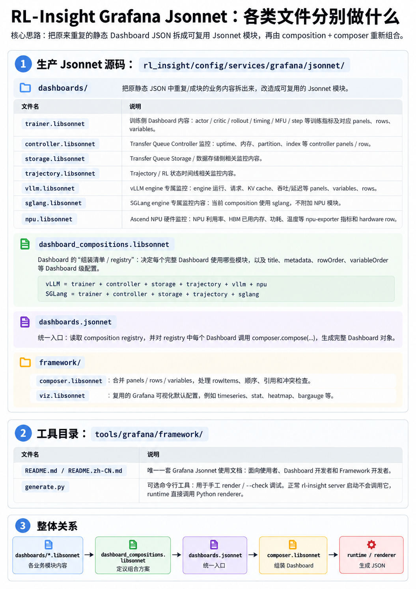
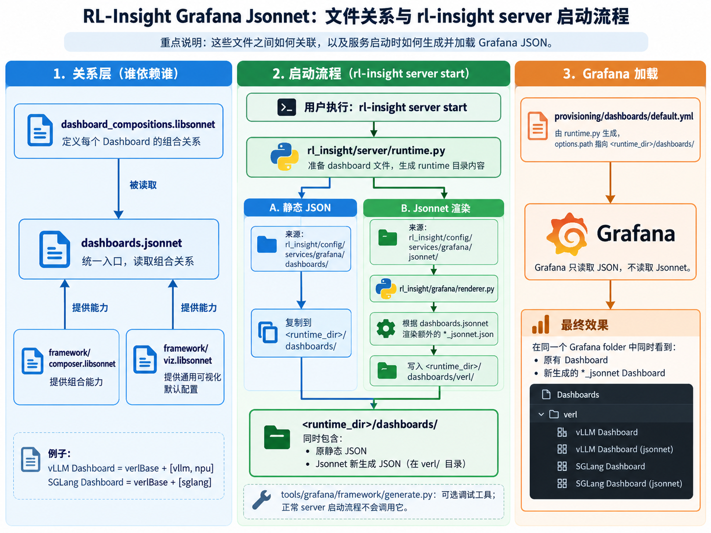

# Grafana dashboard development

# Grafana dashboard

> **英文版本：[README.md](README.md)**
> 

RL-Insight 的 Grafana Dashboard 使用 **Jsonnet** 进行配置和维护。普通用户无需改变使用方式；Dashboard 开发者主要修改 Jsonnet 配置和模块，服务启动时会自动生成 Grafana 所需的 JSON，不需要手动生成或提交 JSON。原有静态 Dashboard 仍然保留，并与 Jsonnet 版本同时加载。

## 概览





## 使用场景

每一个场景都是对随安装包发布的 Jsonnet 源文件做配置改动。改动后继续正常的 RL-Insight 开发/启动流程即可 —— dashboard 会在启动时自动 materialize（不需要手工 generate）。

### 1. 复用现有模块新增 Dashboard

如果现有的 `trainer`、`trajectory`、`npu` 等模块已经包含你需要的监控内容，就不需要再创建新的 `.libsonnet` 文件，只需要在：

```
dashboard_compositions.libsonnet
```

的 `compositions` 中新增一个 Dashboard 条目。

例如：

```
{
  compositions: {
    my_verl_dashboard: {
      modules: [trainer, trajectory, npu],

      dashboard: {
        metadata: {
          name: 'my-verl-dashboard',
          labels: {},
          annotations: {},
        },

        title: 'my_verl_dashboard',
        tags: ['RL-Insight', 'verl'],

        spec: productionSpec,

        variableOrder: [
          'datasource',
          'project',
          'experiment_name',
          'npu_instance',
        ],

        rowOrder: [
          'rl state timeline',
          'training metric',
        ],
      },
    },
  },
}
```

这里新增的：

```
my_verl_dashboard: {
    ...
}
```

就是一个新的 Dashboard 定义。

其中：

```
modules: [trainer, trajectory, npu]
```

表示这个 Dashboard 要把这三个模块提供的内容组合在一起：

```
trainer
    +
trajectory
    +
npu
    ↓
my_verl_dashboard
```

### 2. 新增 Foo Engine 或其他新模块

如果现有 `trainer`、`vllm`、`sglang`、`npu` 等模块里没有你需要的监控内容，就需要新增一个 `.libsonnet` 模块。

先在：

```
rl_insight/config/services/grafana/jsonnet/dashboards/
```

下新增：

```
foo.libsonnet
```

例如：

```
{
  panels: [
    // Foo Engine 的 panel
  ],

  rows: {
    // Foo Engine 的 row
  },

  variables: {
    // Foo Engine 使用的变量
  },
}
```

然后在：

```
dashboard_compositions.libsonnet
```

中先导入：

```
local foo = import 'dashboards/foo.libsonnet';
```

再新增或修改对应的 Dashboard composition：

```
verl_tainer_v1_with_foo_engine_jsonnet: {
  modules: verlBase + [foo],

  dashboard: {
    metadata: {
      name: 'foo-dashboard-id',
      labels: {},
      annotations: {},
    },

    title: 'verl_trainer_v1_with_foo_engine_jsonnet',

    tags: [
      'RL-Insight',
      'verl',
      'foo',
    ],

    spec: productionSpec,

    variableOrder: [
      'datasource',
      'project',
      'experiment_name',
    ],

    rowOrder: [
      'rl state timeline',
      'training metric',
      'foo engine metric',
    ],
  },
},
```

这里：

```
modules: verlBase + [foo]
```

表示：

```
trainer
+ controller
+ storage
+ trajectory
+ foo
↓
Foo Engine Dashboard
```

也就是先复用现有的 VERL 基础模块，再加入新的 `foo` 模块。

---

### 3. 给已有 Dashboard 增加新的监控内容

如果只是想在现有 Dashboard 上增加一些 panel 或 row，可以新增一个附属模块，而不需要直接修改原来的 `trainer.libsonnet`、`vllm.libsonnet` 等文件。

例如新增：

```
dashboards/trainer_extra.libsonnet
```

内容：

```
{
  panels: [{
    key: 'training_extra.custom',
    outputKey: 'panel-training-extra-custom',
    id: 500,
    title: 'Custom training metric',
    queries: [{
      expr: 'custom_training_metric',
    }],
  }],

  rows: {
    'training extra metric': {
      kind: 'RowsLayoutRow',

      spec: {
        title: 'training extra metric',
        collapse: false,

        layout: {
          kind: 'GridLayout',

          spec: {
            items: [{
              kind: 'GridLayoutItem',

              spec: {
                x: 0,
                y: 0,
                width: 24,
                height: 8,

                element: {
                  kind: 'ElementReference',
                  name: 'training_extra.custom',
                },
              },
            }],
          },
        },
      },
    },
  },
}
```

然后在：

```
dashboard_compositions.libsonnet
```

中导入：

```
local trainer_extra =
  import 'dashboards/trainer_extra.libsonnet';
```

并加入已有 Dashboard：

```
modules: verlBase + [trainer_extra, vllm, npu],
```

如果 `trainer_extra` 新增了一个 row，还需要把这个 row 加入：

```
rowOrder
```

例如：

```
rowOrder: [
  'rl state timeline',
  'training metric',
  'vllm engine metric',
  'transfer queue metric',
  'hardware metric',
  'training extra metric',
],
```

这样最终生成的 Dashboard 中就会多出 `trainer_extra` 定义的监控内容。

如果只是给已有 row 增加 panel，也可以使用 `rowItems`，不需要再新增一个 row。

---

### 4. 修改 Framework

普通 Dashboard 的新增、修改一般只需要改：

```
dashboards/*.libsonnet
```

和：

```
dashboard_compositions.libsonnet
```

只有需要修改通用能力时，才需要改：

```
framework/
```

当前主要包含两个文件：

```
framework/
├── composer.libsonnet
└── viz.libsonnet
```

#### 4.1 修改通用可视化配置

如果需要新增或调整所有 Dashboard 都可以复用的 Grafana 可视化配置，可以修改：

```
framework/viz.libsonnet
```

例如增加新的：

```
timeseries
stat
heatmap
bargauge
```

这类通用可视化模板。

#### 4.2 修改 Dashboard 组合规则

如果需要修改模块之间的组合方式，例如新增一种通用的 composition 行为，可以修改：

```
framework/composer.libsonnet
```

它负责把各个模块中的：

```
panels
rows
variables
rowItems
```

组合成最终 Dashboard。

因此一般情况下：

```
新增 panel / metric / row / variable
→ 改 dashboards/*.libsonnet

新增或调整 Dashboard 组合
→ 改 dashboard_compositions.libsonnet

新增通用可视化能力
→ 改 framework/viz.libsonnet

修改通用组合规则
→ 改 framework/composer.libsonnet
```